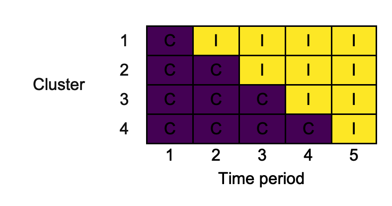

<!-- README.md is generated from README.Rmd. Please edit that file -->

# swcrt 

*Draw and export stepped-wedge cluster randomised trial designs*

[](https://cran.r-project.org/package=swcrt)
[](https://cran.r-project.org/package=swcrt)
[](https://cran.r-project.org/package=swcrt)
[](https://github.com/mjg211/swcrt)
[](https://github.com/mjg211/swcrt)


## Description

**swcrt** is an R package that helps produce diagrams of stepped-wedge
cluster randomised trial (SW-CRT) designs, like those advocated for
inclusion when reporting SW-CRTs by [Hemming *et al.*
(2018)](https://doi.org/10.1136/bmj.k1614). The produced diagrams can be
exported in .docx, .png, and .pptx formats.

## Getting started

The latest development version of **swcrt** available from
[GitHub](https://github.com/) can be installed with:

``` r
devtools::install_github("mjg211/swcrt")
```

An introductory example of how to make use of the package’s core
functionality can be found below. More detailed support is available in
the package vignette, which can be accessed with `vignette("swcrt")`.
For further help, please contact [Michael
Grayling](https://www.newcastle-biostatistics.com/people/michael_grayling/)
at <michael.grayling@newcastle.ac.uk>.

## Example

As a basic example, we consider reproducing the 4-cluster 5-time period
design used in the trial reported by [Bashour *et al.*
(2013)](https://doi.org/10.1136/bmjopen-2013-002674). First, create the
design matrix using `design_sw()`:

``` r
X <- design_sw(clusters_per_time_period = c(0, 1, 1, 1, 1),
               labels                   = c("C", "I"))
X
#>   1   2   3   4   5  
#> 1 "C" "I" "I" "I" "I"
#> 2 "C" "C" "I" "I" "I"
#> 3 "C" "C" "C" "I" "I"
#> 4 "C" "C" "C" "C" "I"
```

Here, we’ve labelled the two conditions `"C"` and `"I"` to reflect their
role as the control and intervention arms. The input
`clusters_per_time_period` is used to specify the design; a single
cluster switches in time periods two through five. We can now plot this
using `draw_sw()`, exporting in .png format:

``` r
png_of_design <- draw_sw(X, make = "png")
```

The resultant .png looks as follows:


## References

Bashour HN, Kanaan M, Kharouf MH, Abdulsalam AA, Tabbaa MA, Cheikha SA.
The effect of training doctors in communication skills on women’s
satisfaction with doctor–woman relationship during labour and delivery:
A stepped wedge cluster randomised trial in Damascus. *BMJ Open*
2013;**3**,e002674. DOI:
[10.1136/bmjopen-2013-002674](https://doi.org/10.1136/bmjopen-2013-002674).
PMID: [23945729](https://pubmed.ncbi.nlm.nih.gov/23945729/).

Hemming K, Taljaard M, McKenzie JE, Hooper R, Copas A, Thompson JA,
Dixon-Woods M, Aldcroft A, Doussau A, Grayling M, Kristunas C, Goldstein
CE, Campbell MK, Girling A, Eldridge S, Campbell MJ, Lilford RJ, Weijer
C, Forbes AB, Grimshaw JM. Reporting of stepped wedge cluster randomised
trials: Extension of the CONSORT 2010 statement with explanation and
elaboration. *BMJ* 2018;**363**,k1614. DOI:
[10.1136/bmj.k1614](https://doi.org/10.1136/bmj.k1614). PMID:
[30413417](https://pubmed.ncbi.nlm.nih.gov/30413417/).
