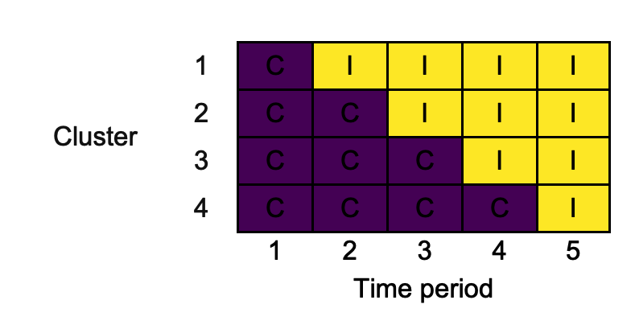
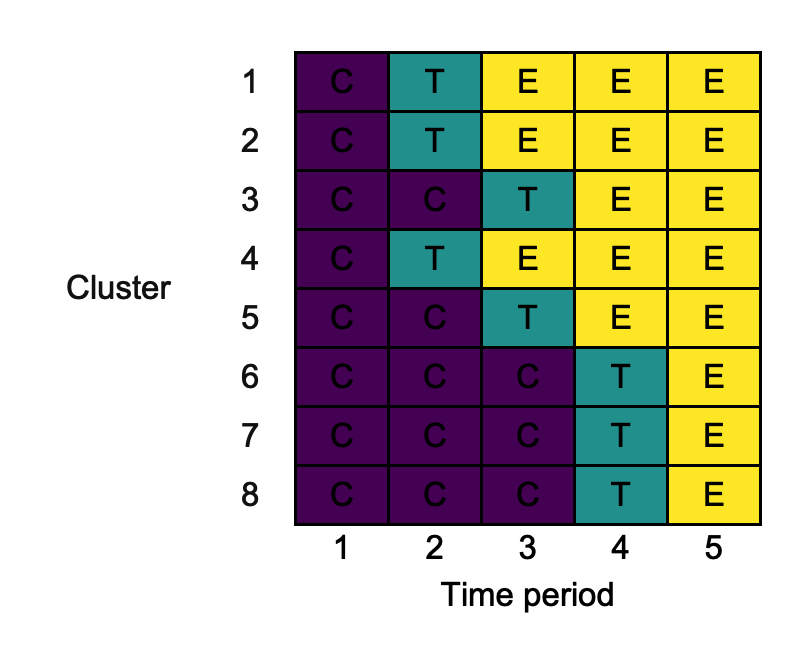
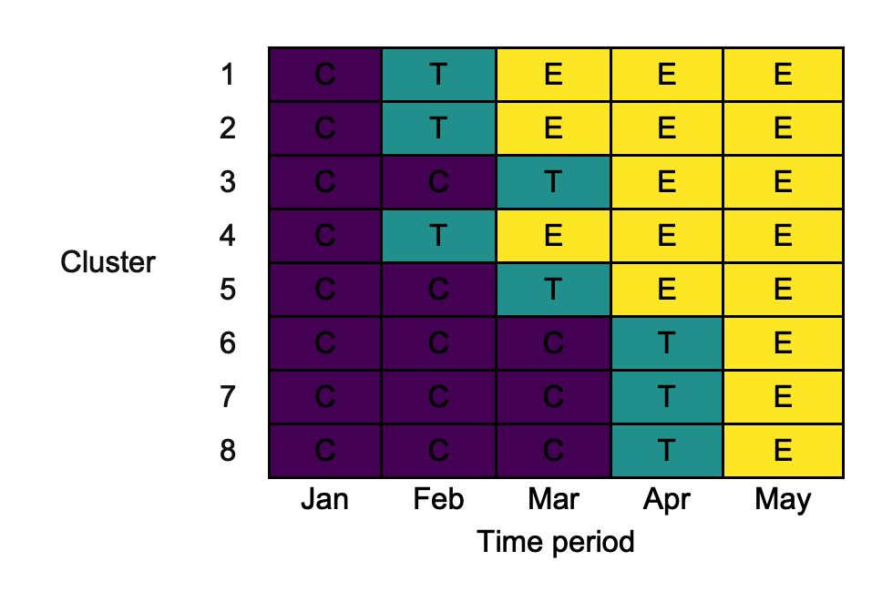
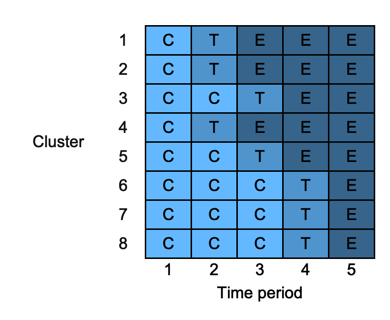
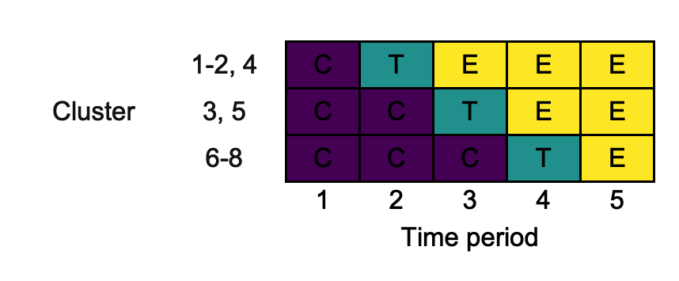
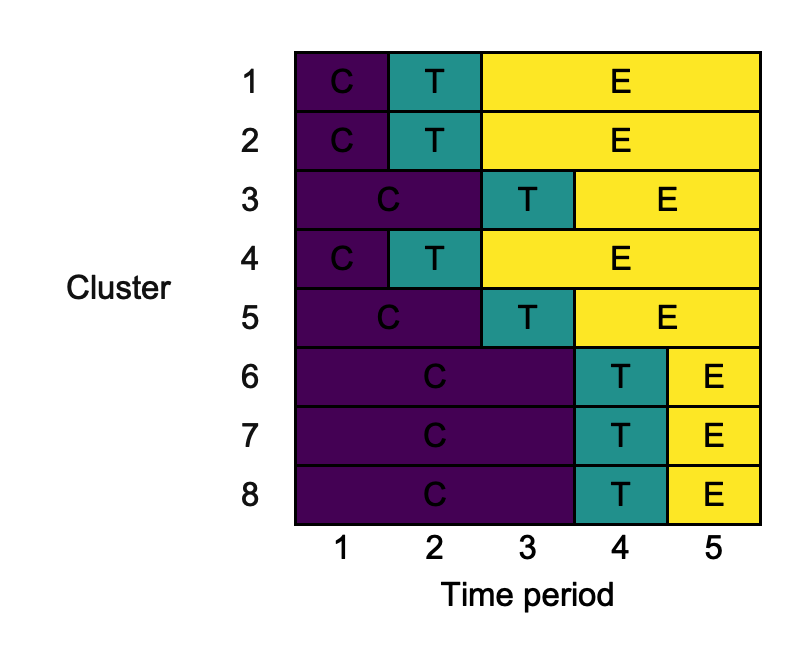
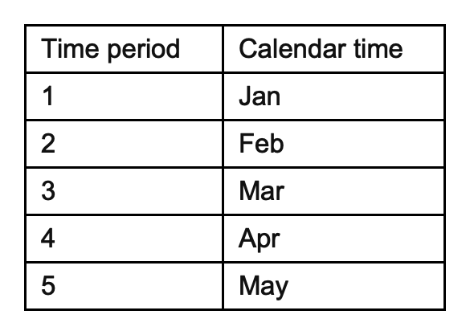

```{r, include = FALSE}
knitr::opts_chunk$set(collapse = TRUE,
                      comment  = "#>",
                      out.width = "50%",
                      fig.align = "center")
```

```{r setup}
library(swcrt)
```

# 1. Introduction

__swcrt__ is an R package that helps produce diagrams of stepped-wedge cluster randomised trial (SW-CRT) designs, like those advocated for inclusion when reporting SW-CRTs by [Hemming *et al.* (2018)](https://doi.org/10.1136/bmj.k1614).
The produced diagrams can be exported in .docx, .png, and .pptx formats.

## 1.1. Getting started

The latest development version of __swcrt__ available from [GitHub](https://github.com/) can be installed with:

```{r, eval = FALSE}
devtools::install_github("mjg211/swcrt")
```

An introductory example of how to make use of the package's core functionality can be found below. 
More detailed support is available in the remainder of this vignette.
For further help, please contact [Michael Grayling](https://www.newcastle-biostatistics.com/people/michael_grayling/) at michael.grayling@newcastle.ac.uk.

## 1.2. Example

As a basic example, we consider reproducing the 4-cluster 5-time period design used in the trial reported by [Bashour *et al.* (2013)](https://doi.org/10.1136/bmjopen-2013-002674).
First, create the design matrix using `design_sw()`:
```{r}
X <- design_sw(clusters_per_time_period = c(0, 1, 1, 1, 1),
               labels                   = c("C", "I"))
X
```
Here, we've labelled the two conditions `"C"` and `"I"` to reflect their role as the control and intervention arms. The input `clusters_per_time_period` is used to specify the design; a single cluster switches in time periods two through five.
We can now plot this using `draw_sw()`, exporting in .png format:
```{r, eval = FALSE}
png_of_design <- draw_sw(X, make = "png")
```

The resultant .png looks as follows:

```{r, echo = FALSE}

```

# 2. Available functions

Currently, two functions are exported for the user: `design_sw` and `draw_sw`.
Details given in their help files is replicated below.

## 2.1. `design_sw`

### Description

`design_sw` builds a binary treatment indicator matrix for a specified conventional (i.e., two treatment conditions, say control and experimental interventions) SW-CRT design, for subsequent use with `draw_sw`.

### Usage

```{r, eval = FALSE}
design_sw(clusters_per_time_period = c(0, 1, 1, 1, 1),
          labels                   = c("0", "1"),
          row_names                = 1:sum(clusters_per_time_period),
          col_names                = 1:length(clusters_per_time_period))
```

### Arguments

- `clusters_per_time_period`: A `numeric` `vector`; element `clusters_per_time_period[i]` indicates the number of clusters that switch to the experimental intervention in time period `i`.
The length of `clusters_per_time_period` thus indicates the number of time periods.
Defaults to `c(0, 1, 1, 1, 1)`.
- `labels`: A `vector` of `length` two, giving labels for the two intervention conditions.
Defaults to `c("0", "1")`.
- `row_names`: A `vector`, giving `rownames` to add to the produced design.
Must have `length` equal to `sum(clusters_per_time_period)`.
- `col_names`: A `vector`, giving `colnames` to add to the produced design.
Must have `length` equal to `length(clusters_per_time_period)`.

### Value

Returns the binary treatment indicator matrix, in `matrix` form, for the implied SW-CRT design.
This can be passed to `draw_sw`.

## 2.2. `draw_sw`

### Description

`draw_sw` draws SW-CRT design diagrams that can be exported in .docx, .png,
and .pptx formats.

### Usage

```{r, eval = FALSE}
draw_sw(design         = design_sw(),
        cp_contents    = design,
        row_names      = FALSE,
        col_names      = FALSE,
        colours,
        combine_rows   = FALSE,
        merge_cols     = FALSE,
        xlab           = "Time period",
        ylab           = "Cluster",
        cp_text_colour = "black",
        key_interventions,
        key_time_periods,
        make           = "print",
        filename       = "swcrt")
```

### Arguments

- `design`: A SW-CRT design (i.e., information on the planned roll-out) to draw a diagram for.
Must be either a `data.frame` or a matrix.
Defaults to `design_sw()`.
- `cp_contents`: Values to add to the cluster-period cells in the produced diagram; modify this when cluster-period cells should contain details on something other than the intervention condition.
Must be either a `data.frame` or a `matrix`.
Defaults to `design`.
- `row_names`: A `logical` variable, indicating whether the row names in the produced diagram should be taken from design or constructed internally.
Defaults to `FALSE`.
- `col_names`: A `logical` variable, indicating whether the column names in the produced diagram should be taken from design or constructed internally.
Defaults to `FALSE`.
- `colours`: A named (see `names`) `character` `vector`, giving the fill colours to add to the cluster-period cells for each of the intervention conditions.
Specified internally by default.
- `combine_rows`: A `logical` variable, indicating whether to combine rows that have identical sequences in the produced diagram.
Defaults to `FALSE`.
- `merge_cols`: A `logical` variable, indicating whether to merge across columns when adjacent cluster-period cells have the same intervention condition in the produced diagram.
Defaults to `FALSE`.
- `xlab`: A `character` string, giving the label for the x-axis in the produced diagram.
Defaults to `"Time period"`.
- `ylab`: A `character` string, giving the label for the y-axis in the produced diagram.
Defaults to `"Cluster"`.
- `cp_text_colour`: A `character` string, giving the colour to use for the text in the cluster-period cells in the produced diagram.
Defaults to `"black"`.
- `key_interventions`: A named (see `names`) `character` `vector`, giving information to include an intervention key.
Not produced by default.
- `key_time_periods`: A named (see `names`) `character` `vector`, giving information to include a time period key.
Not produced by default.
- `make`: A `character` `vector`, giving the (potentially multiple) types of output (export) that are desired.
Can include `"print"` (view within R), `"docx"` (save a .docx MS Word file), `"png"` (save a .png file), and `"pptx"` (save a .pptx MS PowerPoint file).
Defaults to `"print"`.
- `filename`: A `character` string, giving the filename to use for any files that are to be saved.
Defaults to `"swcrt"`.

### Value

A `list` containing the following elements:

- A `flextable` in the slot `$table_design` containing the constructed SW-CRT diagram.
- A `flextable` in the slot `$table_interventions` containing the constructed key summarising the various intervention states.
Will be `NULL` if input `key_interventions` is not specified.
- A `flextable` in the slot `$table_time_periods` containing the constructed key summarising the various time periods.
Will be `NULL` if input `key_time_periods` is not specified.
- A `list` in the slot `$inputs` containing each of the input variables.

# 3. Detailed example

We now demonstrate the utility of each of the input variables through a single
minimally complex example.
We consider the case where there are three 'intervention' conditions: control
(`"C"`), transition (`"T"`), and experimental (`"E"`).
The planned design is:
```{r, eval = FALSE}
design <- rbind(c("C", "T", "E", "E", "E"),
                c("C", "T", "E", "E", "E"),
                c("C", "C", "T", "E", "E"),
                c("C", "T", "E", "E", "E"),
                c("C", "C", "T", "E", "E"),
                c("C", "C", "C", "T", "E"),
                c("C", "C", "C", "T", "E"),
                c("C", "C", "C", "T", "E"))
```
Note that the sequences are deliberately not ordered in a 'clean' manner.
Using all of the default parameters, we use `draw_sw` as follows:
```{r, eval = FALSE}
default <- draw_sw(design)
```
```{r, echo = FALSE}

```

## 3.1. `design`

Above, `design` is specified to `draw_sw` in `matrix` form.
This can be specified instead as a `data.frame` if desired.
Thus the following produces the same output as the above:
```{r, eval = FALSE}
changing_design <- draw_sw(as.data.frame(design))
```

## 3.2. `cp_contents`

Suppose that the plan is to accrue 100 measurements (patient outcomes) in each cluster-period in the control condition, 0 measurements in each cluster-period in the transition condition, and 50 measurements in each cluster-period in the experimental condition.
We can add this information to the diagram, rather than labelling the cluster-period cells with C, T, and E, using the argument `cp_contents`, as follows:
```{r, eval = FALSE}
cp_contents          <- rbind(c(100,   0,  50,  50,  50),
                              c(100,   0,  50,  50,  50),
                              c(100, 100,   0,  50,  50),
                              c(100,   0,  50,  50,  50),
                              c(100, 100,   0,  50,  50),
                              c(100, 100, 100,   0,  50),
                              c(100, 100, 100,   0,  50),
                              c(100, 100, 100,   0,  50))
changing_cp_contents <- draw_sw(design, measurements)
```
```{r, echo = FALSE}
knitr::include_graphics("eg3.2.png")
```

Observe that the cells are still coloured according to the intervention condition.

## 3.3. `row_names`

By default, `draw_sw` labels the rows of the diagram from 1 through to the number of clusters (i.e., the number of rows in `design`).
If we wanted to label these differently (e.g., using location names), we can do this by first adding the desired row names to `design` and then setting `row_names = T` in the call to `draw_sw`:
```{r, eval = FALSE}
rownames(design)   <- letters[1:8]
changing_row_names <- draw_sw(design, row_names = TRUE)
```
```{r, echo = FALSE}

```

## 3.4. `col_names`

Similar to the way we used `row_names` above, we can modify the labels for the diagrams columns using `col_names`.
For example:
```{r, eval = FALSE}
colnames(design)   <- month.abb[1:5]
changing_col_names <- draw_sw(design, col_names = TRUE)
```
```{r, echo = FALSE}

```

## 3.5. `colours`

By default, `swcrt` will choose the fill colours associated with the intervention conditions for you.
If you want to specify these yourself, you can use the option `colours`, which must be a named (see `names`) `character` `vector` containing a value for all the intervention conditions given in `design`:

```{r, eval = FALSE}
changing_colours <- draw_sw(design, colours = c("C" = "steelblue1",
                                                "T" = "steelblue3",
                                                "E" = "steelblue4"))
```
```{r, echo = FALSE}

```

## 3.6. `combine_rows`

In some cases, particularly for designs with a large number of clusters, it may make sense to plot the design with the rows defining the unique sequences in use.
This can be achieved using `combine_rows`, which also perhaps row name manipulation for us:
```{r, eval = FALSE}
changing_combine_rows <- draw_sw(design, combine_rows = TRUE)
```
```{r, echo = FALSE}

```

## 3.7. `merge_cols`

In some cases, we might want to within rows merge across columns that contain the same content.
This can be achieved using the input `merge_cols` as follows:
```{r, eval = FALSE}
changing_merge_cols <- draw_sw(design, merge_cols = TRUE)
```
```{r, echo = FALSE}

```

## 3.8. `xlab`

We can change the label for the diagram's columns using `xlab`:
```{r, eval = FALSE}
changing_xlab <- draw_sw(design, xlab = "Periods of time")
```
```{r, echo = FALSE}

```

## 3.9. `ylab`

Similarly, we can change the label for the diagram's rows using `ylab`:
```{r, eval = FALSE}
changing_ylab <- draw_sw(design, ylab = "Group")
```
```{r, echo = FALSE}

```

## 3.10. `cp_text_colour`

Certain cluster-period fill colours may make reading the contents of the cluster-periods challenging.
We can overcome this by modifying the cluster-period text colour with `cp_text_colour`:
```{r, eval = FALSE}
changing_cp_text_colour <- draw_sw(design, cp_text_colour = "white")
```
```{r, echo = FALSE}

```

## 3.11. `key_interventions`

Particularly when the cluster-period cells are labelled with something other than the intervention condition, it may be helpful to produce a separate key describing the intervention conditions in more detail.
We can do this with `key_intervention`, which should be a named `character` `vector`:
```{r, eval = FALSE}
changing_key_interventions <- draw_sw(design,
                                      key_interventions = c("C" = "Control",
                                                            "T" = "Transition",
                                                            "E" =
                                                              "Experimental"))
```
This produces the diagram as before, but also provides:
```{r, echo = FALSE}
knitr::include_graphics("eg3.11_key_interventions.png")
```

## 3.12. `key_time_periods`

Similarly to the above, we can also produce a key giving more detail on the time periods with `key_time_periods`:
```{r, eval = FALSE}
key_time_periods           <- month.abb[1:5]
names(key_time_periods)    <- 1:5
changing_key_interventions <- draw_sw(design,
                                      key_time_periods = key_time_periods)
```
```{r, echo = FALSE}

```

## 3.13. `make`

`swcrt` can print the produced diagram for view in R, and can export the diagram in a variety of formats.
Different formats can be produced simultaneously.
We specify what we desire using `make`.
E.g., all possible options:
```{r, eval = FALSE}
changing_make <- draw_sw(design, make = c("print", "docx", "png", "pptx"))
```

## 3.14. `filename`

When we produce a .docx, .png, or .pptx file, a filename is required.
This is specified using `filename`.
For example:
```{r, eval = FALSE}
changing_filename <- draw_sw(design, make = "docx", filename = "different_name")
```
Will save a file different_name.docx.

## References

Bashour HN, Kanaan M, Kharouf MH, Abdulsalam AA, Tabbaa MA, Cheikha SA.
The effect of training doctors in communication skills on women’s satisfaction with doctor–woman relationship during labour and delivery: A stepped wedge cluster randomised trial in Damascus.
*BMJ Open* 2013;__3__,e002674.
DOI: [10.1136/bmjopen-2013-002674](https://doi.org/10.1136/bmjopen-2013-002674).
PMID: [23945729](https://pubmed.ncbi.nlm.nih.gov/23945729/).

Hemming K, Taljaard M, McKenzie JE, Hooper R, Copas A, Thompson JA, Dixon-Woods M, Aldcroft A, Doussau A, Grayling M, Kristunas C, Goldstein CE, Campbell MK, Girling A, Eldridge S, Campbell MJ, Lilford RJ, Weijer C, Forbes AB, Grimshaw JM.
Reporting of stepped wedge cluster randomised trials: Extension of the CONSORT 2010 statement with explanation and elaboration.
*BMJ* 2018;__363__,k1614.
DOI: [10.1136/bmj.k1614](https://doi.org/10.1136/bmj.k1614).
PMID: [30413417](https://pubmed.ncbi.nlm.nih.gov/30413417/).
